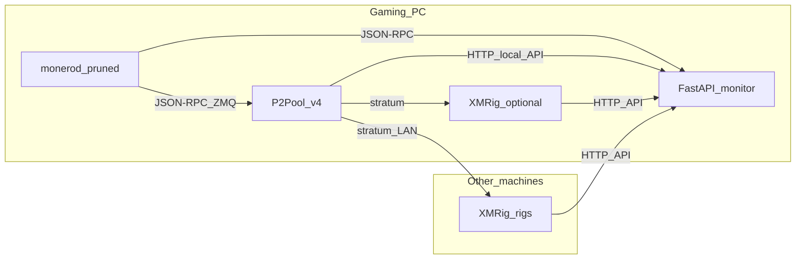

# Architecture

HashFarm is an **operations toolkit** and **read-only monitor** for a home or small-office Monero **P2Pool** mining layout.

## High-level diagram

## Components

### `monerod` (pruned)

[`scripts/garuda/monerod-pruned.sh`](../scripts/garuda/monerod-pruned.sh) runs a pruned full node with RPC bound for localhost (configurable) and **ZMQ pub** for P2Pool. Chain data lives under `MONERO_DATA_DIR` (default `~/.bitmonero`).

### P2Pool v4

[`scripts/garuda/p2pool-v4.sh`](../scripts/garuda/p2pool-v4.sh) downloads a signed official Linux x64 release, then runs `p2pool` against local `monerod`. It exposes **stratum** (e.g. `:3333`) and **local HTTP** (`/local/stratum`, `/local/p2p`) for observability.

### XMRig

Scripts generate **CPU** RandomX configs pointing at the gaming PC’s stratum URL. Each rig exposes an **HTTP API** (Bearer token) so the monitor can read `hashrate.total`.

### FastAPI monitor

Python 3.x, **httpx** async client:

- Polls `monerod` JSON-RPC (`get_info`, optional `get_block_template`).
- Polls P2Pool local endpoints.
- Polls each URL in `XMRIG_API_URLS` (`/2/summary` or `/1/summary`).
- Optional CoinGecko spot price and SMTP alerts.

State is held in-process (`state.SNAPSHOT`); there is no relational DB for the live UI.

### Metrics and probes

- Each successful (or failed) poll can append a row to **SQLite** (`METRICS_SQLITE_PATH`) for local trend analysis.
- **`GET /metrics`** exposes the latest snapshot as **Prometheus** text for scrapers.
- **`GET /health`** is liveness; **`GET /ready`** fails if no recent snapshot (for systemd/Kubernetes-style probes).

## Configuration flow

1. Operator copies `scripts/common/env.template` → `.env` at repo root.
2. Shell scripts `source` `.env` when present.
3. Monitor loads `.env` from cwd and parent via `python-dotenv` in `settings.py`.

## Trust boundaries

- **Treat `.env` as secret.** It includes wallet main address, API tokens, and optionally SMTP credentials.
- **RPC** should stay on localhost or a VPN; exposing `monerod` JSON-RPC to the internet without authentication is unsafe.
- **XMRig HTTP API** with `0.0.0.0` bind should sit behind a firewall; the monitor expects the same bearer token as configured on miners.

## Extension points

- New collectors: add a client module and extend `collector.build_snapshot`.
- Alerts: SMTP path in settings; could add webhook or Pushover later.
- CI: GitHub Actions can run `ruff`/`pytest` on `monitor/` when tests exist.
